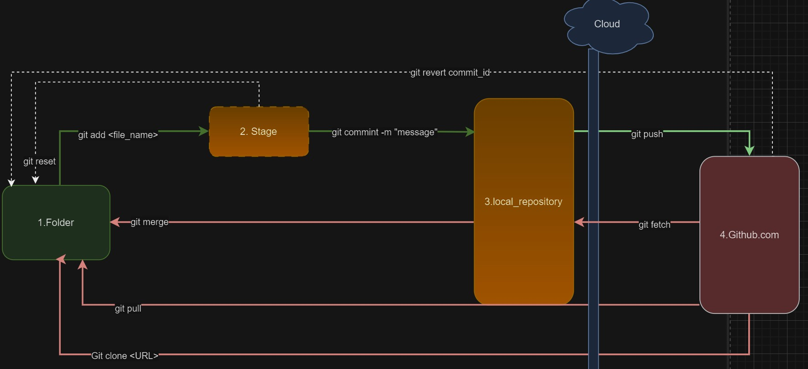

# Learn_Git

## Used commands list
```
git clone <url>
git add <file-name>
git commit -m <message>
git push
git fetch
git merge
git pull
git revert <commit id>
git reset
git branchhttps://github.com/pulls
```


## un-used command List

```

git rebase
git cherrypick
git hotfix
git blame
git stash
git pop
```


## How to see at current branch in git
==>Git bash and Sourcetree shows it

## how to switch branch in git
==> Using "git checkout" command

## Q. Difference between rebase and merge
==>Rebasing rearranges your commits to sit on top of the latest changes

  ### Rebase or fast forward merge
  

  ### simple-merge
  

## Q. what is squash or group commit
  ### Squash or group commit
  


## Q. What is the difference between git pull and git fetch
==> Git fetch get a code from remote repository to local repository, **git pull** get the code from remote repository to local file

## Q. What is the difference between git commit and git push
==> Git commit transfers the changes from the local file to the local repository and git push transfers the changes from local repository to remote repository.
Git commit will ask for the message but git push will not

## Q. What is the difference between git reset and git revert
==> Git reset transfer back changes from stage to local file, Git revert transfer back changes from remote repository to local file



## Extra

1
2
3
4
5
6
7
8
9
10
11
12
13
14
15
16
17
18
19
20
21
22
23
24
25
26
27
28
29
30
30B
31
32
33
34
35
36
37
38
39
40
