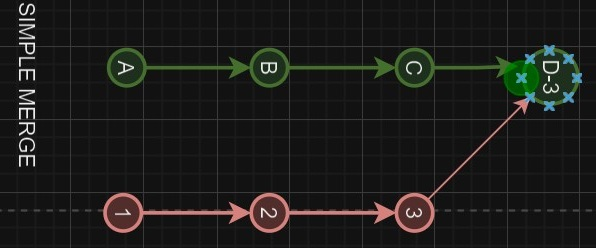

# Learn_Git

## Used commands list
```
git clone <url>
git add <file-name>
git commit -m <message>
git push
git fetch
git merge
git pull
git branch
```


## un-used command List

```
git rebase
git cherrypick
git hotfix
git blame
git stash
git pop
```


## How to see at current branch in git
==>Git bash and Sourcetree shows it

## how to switch branch in git
==> Using "git checkout" command

Q - What is the difference between Simple merge, Squash merge and Rebase merge
==> not know
Differane| #1.Merge | #2.Rebase| #3.Squash 
--- | --- | --- | --- 
Between| Shows two parent,also called simple merge | Shows one parnet ,also called fast forward | Shows one parnet becuase merge  multiple commet on singe commit  
Q. What is the difference between git pull and git fetch
==> Git fetch get a code from remote repo to local repo, pull the code from local repo to local file ues pull command
Q. What is the difference between git commit and git push
==> before push the code to the remote repo we give commit message , so firt commit a message then use push command to send a code from local to remote server 
Q. What is the difference between git reset and git revert
==> If we got some conflict we use git revert that undo the current changes , dont know about git RESET

1
2
3
4
5
6
7
8
9
10
11
12
13
14
15
16
17
18
19
20
21
22
23
24
25
26
27
28
29
30
30B
31
32
33
34

### Rebase or fast forward merge


---

### Squash or group commit


---

### simple-merge

